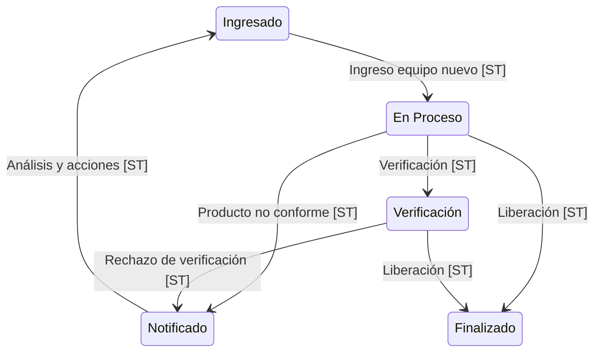

<!--
  GENERADO por `npm run generar-mapa-blueprint` (`scripts/generar-mapa-blueprint.ts`) a partir de
  `TRANSITIONS_EQUIPO_NUEVO` de `transitions.ts`, a través de `CATALOGO_POR_FLUJO` de `flujos.ts`. NO EDITAR A MANO: la prueba anti-desfase
  (`mapaBlueprint.test.ts`, RQ-MB-06) lo detecta.
-->

# Mapa del Blueprint de Equipo nuevo — diagrama completo

## Leyenda de áreas

- **[C]** — Comercial
- **[ST]** — Servicio Técnico
- **[CO]** — Compras

Una transición de área compartida (p. ej. `Comercial / Compras`) lleva las dos marcas, una por
cada área que interviene.
